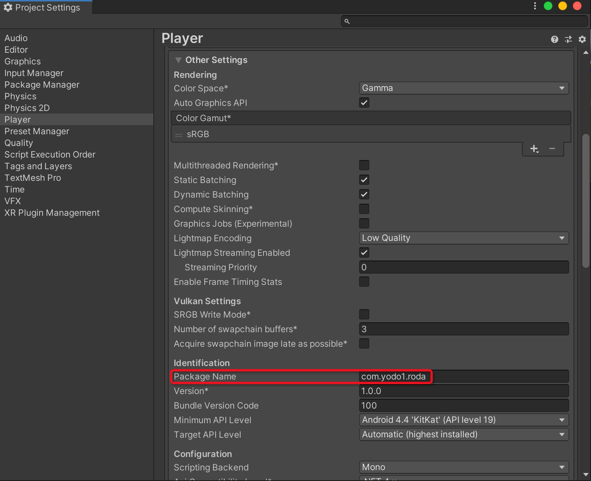
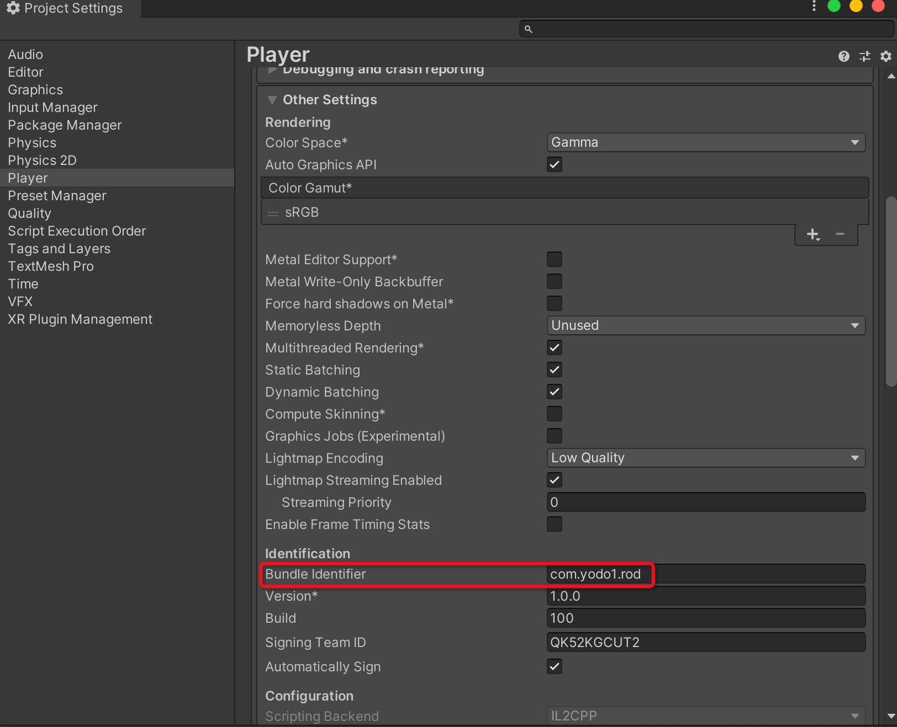

# Yodo1-MAS-Unity-Plugin-Demo

## Overview

MAS is Yodo1's in-app monetization solution.

Please check out the [documentation](https://support.yodo1.com/hc/en-us/articles/1500001982341) to get started on integrating.

## Demo

The Demo using the Game(ROD) KEYs. If you want to test your Game, please make the following changes:

* Android - Change the `PackageName` to your game's `PackageName` 
  
* iOS - Change the `Bundle Identifier` to your game's `Bundle Identifier`
  
* Change the `App Key` and `AdMob App ID` to your game's KEYs, see the detailed modification method [here](https://support.yodo1.com/hc/en-us/articles/1500001982341).

## Support

For feature requests, improvements, questions or any other integration issues using MAS Mediation by Yodo1, please contact us via our support page: https://support.yodo1.com/hc/en-us.
